# Viatour Travel

Viatour Travel is a modern **tour and reservation management platform** built with **ASP.NET Core MVC**, **Razor Views**, **MongoDB**, and a **DTO-based layered architecture**.

The project combines a public-facing travel experience with a fully customized admin panel where tours, categories, reservations, reviews, dashboard analytics, reporting, and email workflows can be managed through a clean operational structure.

---

## Project Overview

Viatour Travel was developed as a portfolio-level web application focused on **real workflow scenarios** rather than a simple CRUD demo.

The platform allows users to:

- browse tours
- search and filter travel content
- view detailed tour pages
- explore image galleries
- view AI-supported map sections
- read approved customer reviews
- create reservations

On the admin side, the system provides management features for:

- dashboard monitoring
- tour management
- category management
- reservation approval
- review moderation
- tour plan management
- reservation reporting
- email notification workflows

---

## Technologies Used

- **ASP.NET Core MVC**
- **Razor Views**
- **MongoDB**
- **MongoDB.Driver**
- **AutoMapper**
- **MailKit**
- **ClosedXML**
- **QuestPDF**
- **Bootstrap 5**
- **Bootstrap Icons**
- **Custom CSS**
- **JavaScript / Fetch API**

---

## Architecture

The project follows a clean and practical layered structure:

`Entity -> DTO -> Service -> Controller -> View`

### Architectural Principles

- Business logic is kept out of Views
- DTO-based data flow is used throughout the application
- Entity and Service layers are separated
- Admin panel and public UI are separated
- MongoDB ObjectId / string mapping is handled carefully
- Reusable and scalable structure is prioritized
- Overengineering is avoided in favor of practical solutions

---

# Public User Experience

## Tour Listing

Users can explore available tours through a modern listing screen designed for readability and discovery.

**Tech used:** ASP.NET Core MVC, Razor Views, Bootstrap, Custom CSS

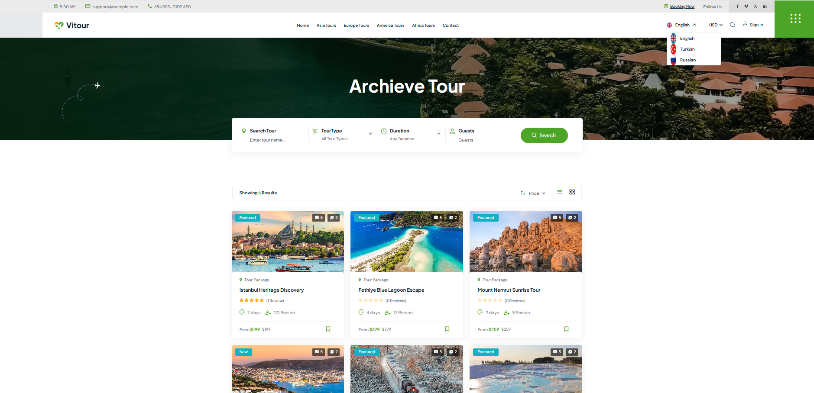

---

## Tour Search and Filter Experience

The tour listing page also includes search and parameter-based filtering to improve the navigation experience.

**Tech used:** ASP.NET Core MVC, Razor Views, query-based filtering

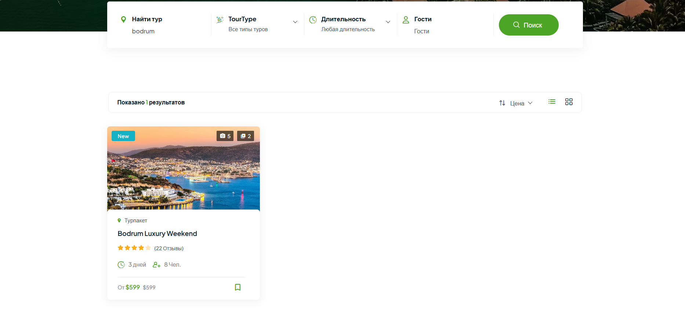

---

## Tour Detail Page

The tour detail page brings together the core public-side experience in one place, including tour information, visual sections, reviews, and reservation actions.

**Tech used:** ASP.NET Core MVC, Razor Views, DTO-based architecture

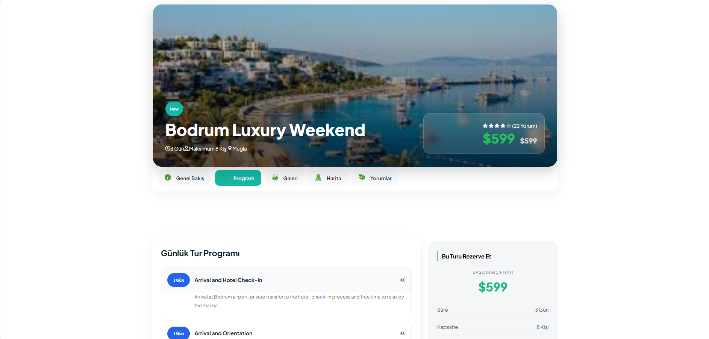

---

## Tour Gallery Section

Each tour includes its own gallery structure where uploaded images are displayed in an organized and visual way.

**Tech used:** Razor Views, custom gallery UI, image-based content management

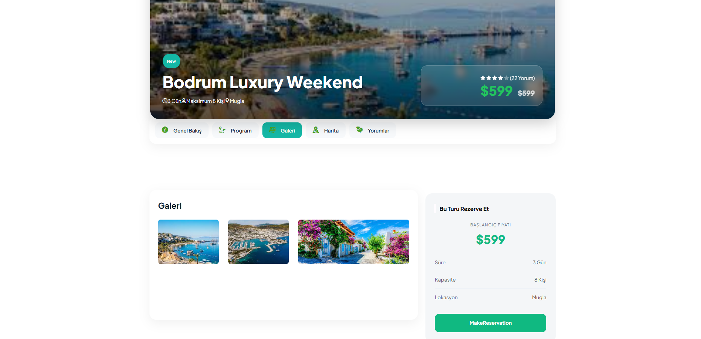

---

## AI Map Section

The project includes an AI-supported static destination map section inside the tour detail page.

**Tech used:** DTO integration, Razor Views, custom UI integration

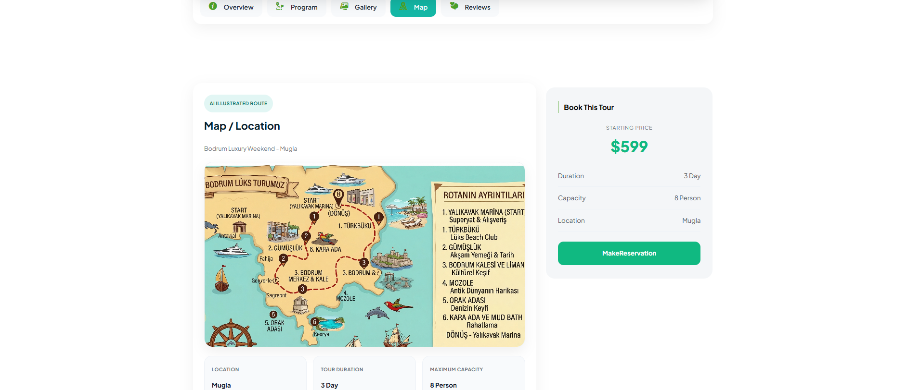

---

## Review Section

Approved customer reviews are displayed publicly on the tour detail page as part of the user experience.

**Tech used:** MongoDB, moderation-based review workflow, Razor Views

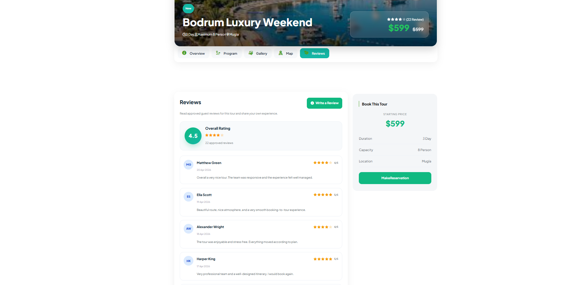

---

## Reservation Form

Users can create reservations directly from the tour detail page through an integrated reservation form.

**Tech used:** ASP.NET Core MVC, model binding, MongoDB, reservation workflow

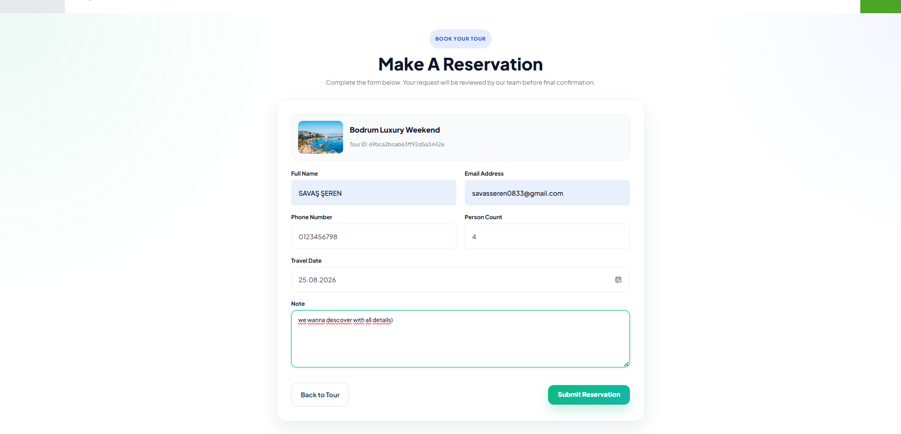

---

# Admin Panel Experience

## Admin Dashboard

The admin dashboard was designed as a modern operational control center. It provides quick visibility into system activity, moderation flow, and reservation workload.

**Tech used:** ASP.NET Core MVC, MongoDB, custom admin layout, custom CSS

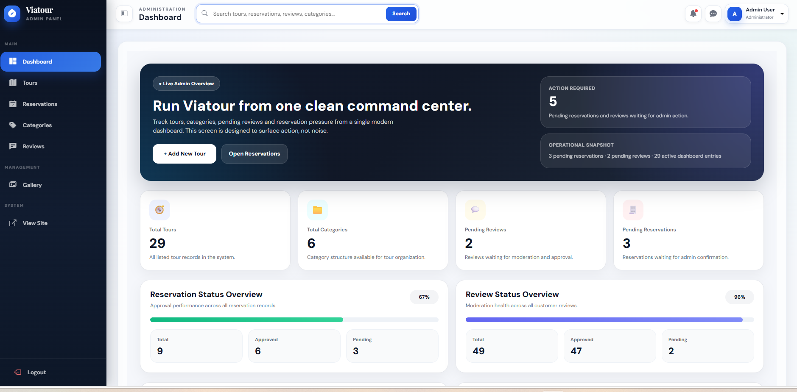

---

## Tour Management

The admin tour list provides a centralized management view for existing tour records.

**Tech used:** ASP.NET Core MVC, CRUD structure, service layer, Razor Views

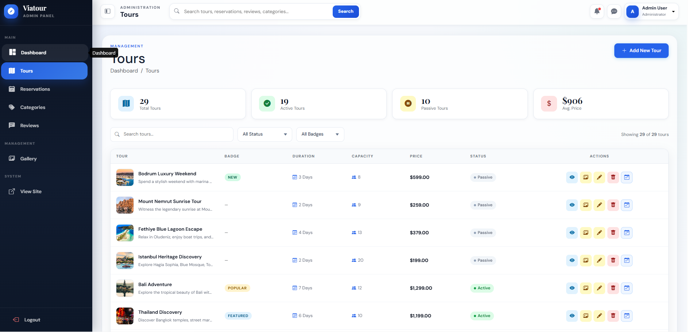

---

## Add Tour Page

The admin panel includes a dedicated page for adding new tours and managing the main content structure.

**Tech used:** ASP.NET Core MVC, DTO-based CRUD structure, AutoMapper

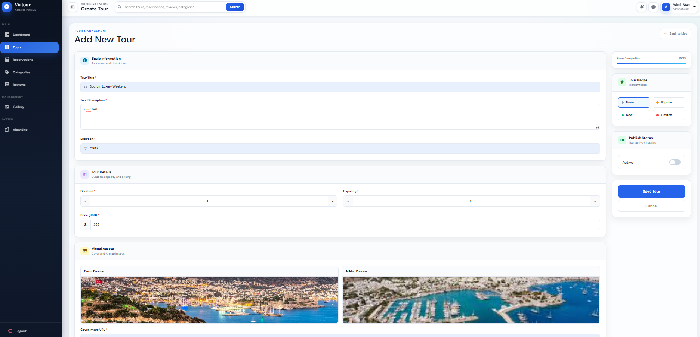

---

## Tour Plan Management

Tour plans are managed separately as part of each tour’s structured content workflow.

**Tech used:** MongoDB, service layer, DTO structure, admin content management

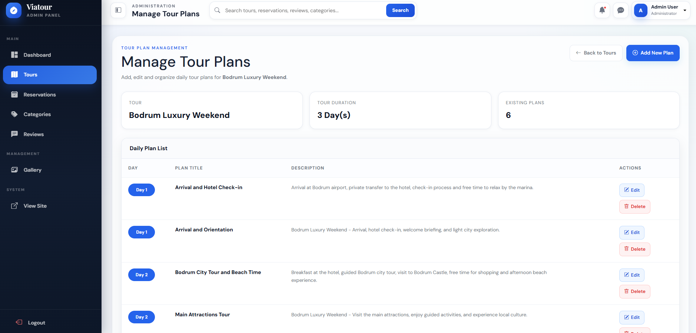

---

## Category Management

The category management screen allows administrators to create, update, list, and delete categories through a dedicated interface.

**Tech used:** ASP.NET Core MVC, MongoDB, CRUD operations, Razor Views

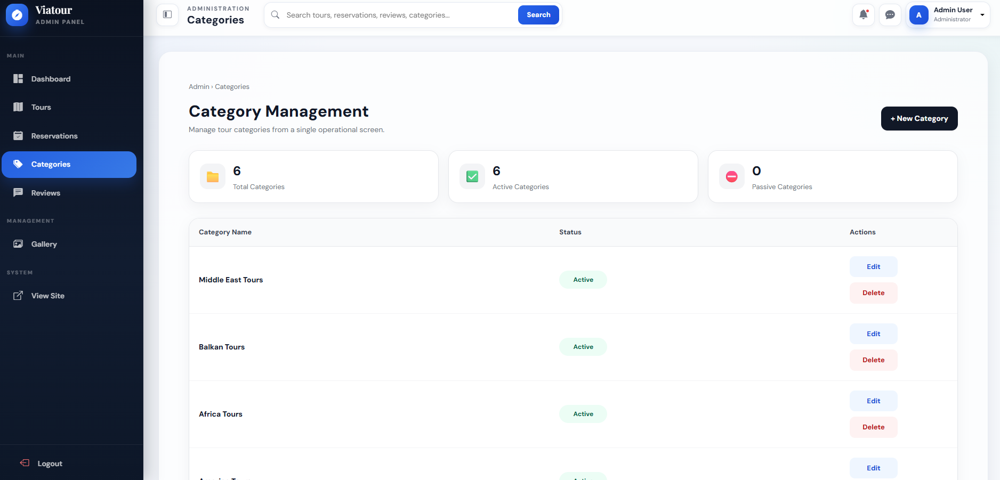

---

## Reservation Management

Reservations are stored as pending by default and can be reviewed, approved, or deleted by the admin.

**Tech used:** MongoDB.Driver, async service structure, approval workflow

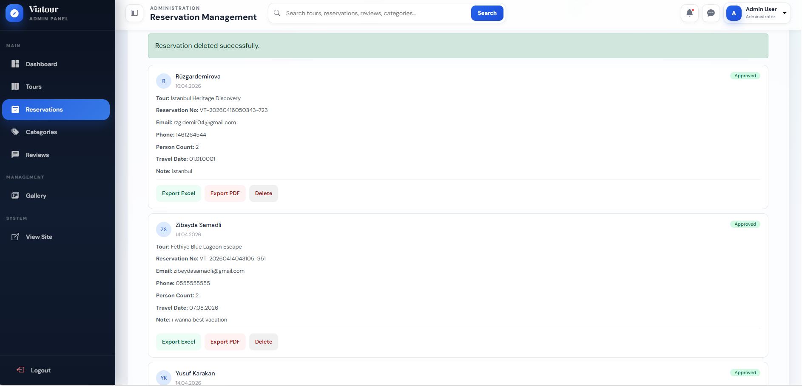

---

## Review Moderation

User reviews are moderated through the admin panel before becoming publicly visible.

**Tech used:** MongoDB, ReviewService, moderation workflow, custom admin UI

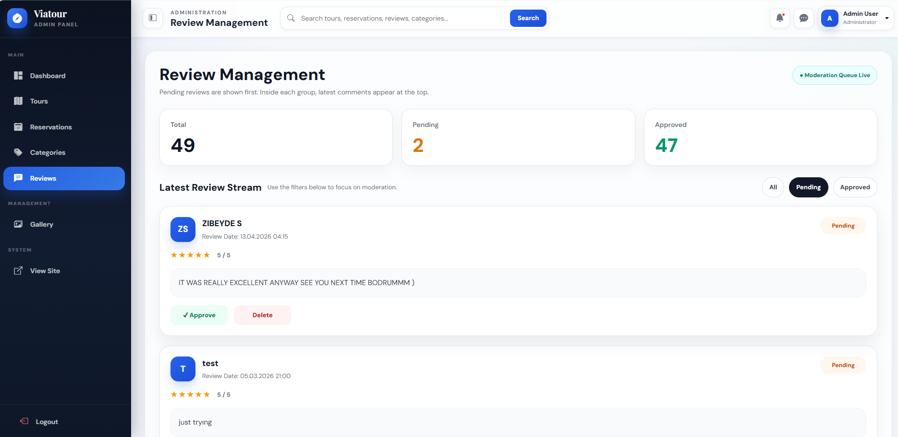

---

## Reservation Reporting

The admin panel supports reservation reporting operations for selected tours.

**Tech used:** ClosedXML, QuestPDF, reporting workflow, admin operations

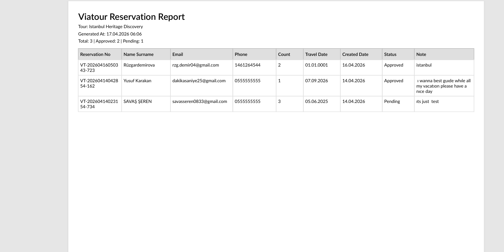

---

# Communication Workflow

## MailKit Confirmation Email

When an admin approves a reservation, the system sends an automatic confirmation email to the customer using MailKit.

**Tech used:** MailKit, SMTP configuration, reservation approval workflow

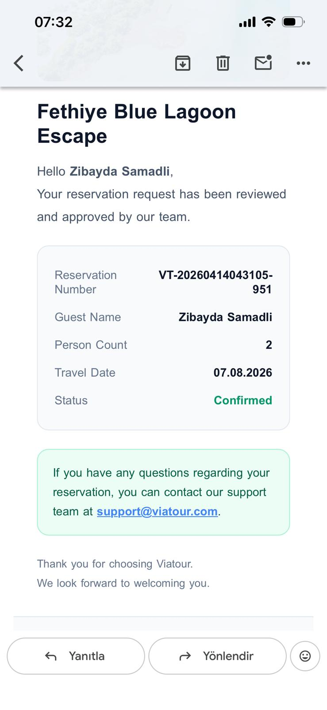

---

# Reservation Workflow

The reservation system is built around an approval-based process:

1. User creates a reservation from the tour detail page  
2. Reservation is stored as **pending**  
3. Admin reviews the reservation in the admin panel  
4. Admin approves or deletes the request  
5. The system sends a confirmation email after approval  

---

# Review Workflow

The review system follows a moderation-first approach:

1. User submits a review  
2. Review is stored as **pending**  
3. Admin reviews the comment  
4. Admin approves or deletes it  
5. Only approved reviews become publicly visible  

---

# Implemented Modules

- Tour CRUD
- Category CRUD
- TourPlan system
- Review system
- Review moderation workflow
- Reservation system
- Reservation approval / delete flow
- MailKit reservation approval email flow
- Tour image gallery system
- Custom admin panel layout
- Admin dashboard
- Reservation reporting
- Modern operational management screens

---

## Project Structure

```text
Viatour_Travel
│
├── Viatour_Travel
│   ├── Controllers
│   ├── Dtos
│   ├── Entities
│   ├── Mapping
│   ├── Services
│   ├── Settings
│   ├── ViewComponents
│   ├── Views
│   ├── wwwroot
│   │   └── Screenshot
│   └── Program.cs
│
├── Viatour_Travel.sln
└── README.md
```

---

## Installation

### 1. Clone the repository

```bash
git clone https://github.com/SavashSheren/Viatour_Travel.git
```

### 2. Open the project

Open the solution in **Visual Studio** or **JetBrains Rider**.

### 3. Restore packages

```bash
dotnet restore
```

### 4. Configure `appsettings.json`

Update the required configuration values:

- MongoDB connection string
- database name
- collection names
- SMTP settings for MailKit

### 5. Run the project

```bash
dotnet run
```

---

## Important Notes

### MongoDB

Make sure MongoDB is running and your connection string is correctly configured.

### MailKit

The reservation approval email feature requires valid SMTP credentials.

### Security

Sensitive credentials such as email passwords should never be committed to GitHub.

---

## Future Improvements

- richer dashboard analytics
- enhanced admin notifications
- advanced public-side filtering
- cloud-based image storage
- deployment and CI/CD improvements

---

## Author

**Savaş**

This project was built as a portfolio-oriented travel management application with a strong focus on real workflow scenarios, clean service architecture, and modern admin experience.
